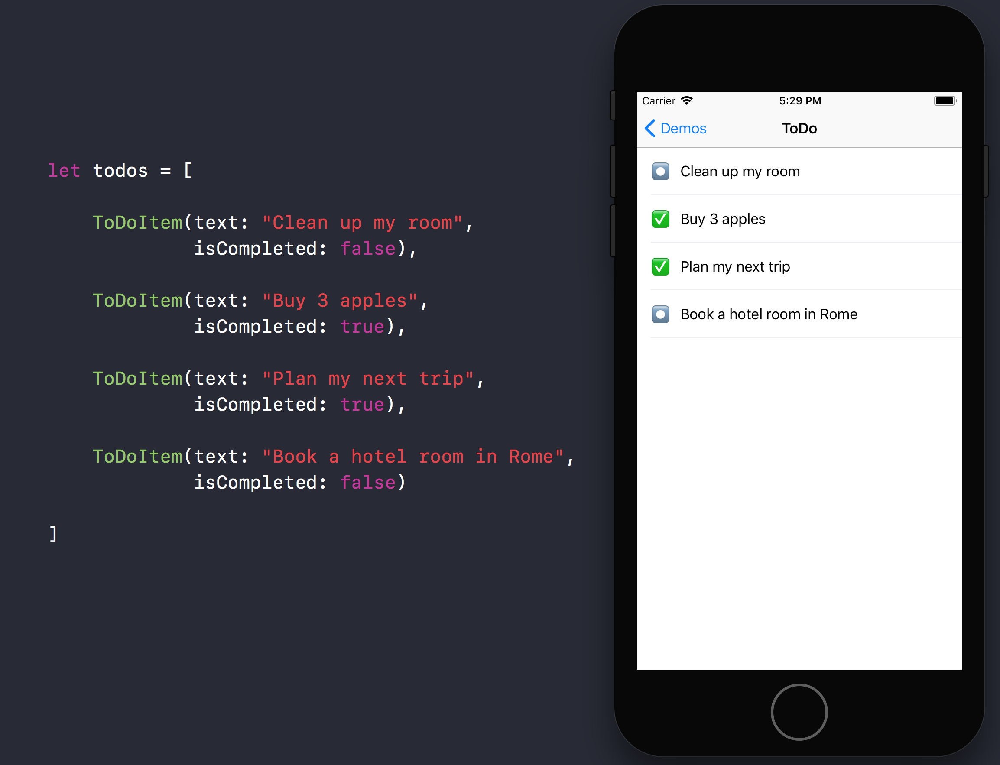

<p align="center">
  
</p>

<p align="center">
    <a href="https://dashboard.buddybuild.com/apps/59e8c206d51a9e0001da3a64/build/latest?branch=master">
        
    </a>
    
    <a href="https://developer.apple.com/swift/">
        
    </a> 
    
    
</p>

MenuListKit provides a fast way to create lists and menus with declarative programming in Swift. It's a thin abstraction layer over the powerful [IGListKit](https://github.com/Instagram/IGListKit).


----------------

| | Features |
:---: | --- |
🚀 | Declaratively define lists and menu |
🙏🏻 | The code reflects the UI |
📁 | Less code and less files to manage |
⚡️ | No performance impact |
🔋 | Efficient cell updates thanks to `ListDiffable` by [IGListKit](https://github.com/Instagram/IGListKit) |

***

The idea of MenuListKit is to provide a declarative way to create menus in iOS without writing boilerplate code. With MenuListKit you can focus better on the architecture and the business logic of your app 👍🏻 

You won't lose time writing the same error-prone boilerplate code 💩.

The final result is more maintainable and modular codebase ✅. 

Give it a shot and see the difference 🎉!

In the example below there's a classic and simple **ToDo List** app; as you can see the array of models reflects the cells in the `UICollectionView`. This will make you code more explicit and readable.



## Requirements

* iOS 9.0+
* Swift 4.0+
* Xcode 9.0+

## Installation

### CocoaPods

MenuListKit is available through [CocoaPods](http://cocoapods.org). To install
it, simply add the following line to your Podfile:

```ruby
pod 'MenuListKit'
```

## Usage

### Define your `MenuItem`

The first thing to do is to create a `UICollectionViewCell` with a custom UI. You can both create a cell programmatically or load it from a xib.

```swift

class ToDoCell: UICollectionViewCell {

    @IBOutlet private weak var statusLabel: UILabel!
    @IBOutlet private weak var textLabel: UILabel!
    
    var text: String? {
        get { return textLabel.text }
        set { textLabel.text = newValue }
    }
    
    var isCompleted: Bool = false {
        didSet {
            statusLabel.text = isCompleted ? "✅" : "⏺"
        }
    }
    
    override func awakeFromNib() {
        super.awakeFromNib()
        isCompleted = false
    }

}

```

In MenuListKit every cell is represented by a `MenuItem` object. The `MenuItem` class is a "model representation" of your cell. It contains all the information to configure the `UICollectionViewCell` view.

Create your item class that inherits from `MenuItem` and implements `ListDiffable` (from [IGListKit](https://instagram.github.io/IGListKit/iglistdiffable-and-equality.html)).

> Remember to add `import IGListKit` at the top

```swift

import MenuListKit
import IGListKit

class ToDoItem: MenuItem<ToDoCell>, ListDiffable {
    
    let uuid = UUID().uuidString
    var text: String
    var isCompleted: Bool
    
    init(text: String, isCompleted: Bool) {
        self.text = text
        self.isCompleted = isCompleted
        super.init(bundle: Bundle.main,
                   height: 55,
                   actionDelegate: nil)
    }
    
    override func bind(to cell: ToDoCell) {
        cell.text = text
        cell.isCompleted = isCompleted
    }
    
    // MARK: - ListDiffable
    
    func diffIdentifier() -> NSObjectProtocol {
        return uuid as NSObjectProtocol
    }
    
    func isEqual(toDiffableObject object: ListDiffable?) -> Bool {
        if let object = object as? ToDoItem {
            return object.text == text && object.isCompleted == isCompleted
        }
        return false
    }
    
}

```

### `MenuAdapterItem` and data source

To load an array of models into a `UICollectionView`, we've reused the idea of IGListKit and we've created the `MenuListAdapter`.

To all get the work done, implement the data source protocol `MenuListAdapterDataSource` to provide the array of models to the collectionView. The adapter will manage all insertions, deletions and updates based on the array.
You can also provide an `UIView` to present when there's no data to show.

```swift
import MenuListKit
import IGListKit

class ToDoViewController: UIViewController {
    
    let collectionView = UICollectionView(frame: .zero, 
                                          collectionViewLayout: UICollectionViewFlowLayout())
    
    lazy var adapter: MenuListAdapter = {
        return MenuListAdapter(viewController: self)
    }()
    
    let todos = [
    
        ToDoItem(text: "Clean up my room", isCompleted: false),
        ToDoItem(text: "Buy 3 apples", isCompleted: true),
        ToDoItem(text: "Plan my next trip", isCompleted: true),
        ToDoItem(text: "Book a hotel room in Rome", isCompleted: false)
        
    ]
    
    override func viewDidLoad() {
        super.viewDidLoad()

        collectionView.backgroundColor = .white
        view.addSubview(collectionView)
        
        adapter.collectionView = collectionView
        adapter.dataSource = self
    }
    
    override func viewDidLayoutSubviews() {
        super.viewDidLayoutSubviews()
        collectionView.frame = view.bounds
    }
    
}

// MARK: - MenuListAdapterDataSource

extension ToDoViewController: MenuListAdapterDataSource {
    
    func objects(for menuListAdapter: MenuListAdapter) -> [ListDiffable & BaseMenuItem] {
        return todos
    }
    
    func emptyView(for menuListAdapter: MenuListAdapter) -> UIView? {
        return nil
    }
    
}

```

## More resources

* Download our [example app](https://github.com/MoonCoders/MenuListKit/tree/master/Example)
* [Getting started guide](https://github.com/Instagram/IGListKit#getting-started) with IGListKit

## About us


We're 3 friends who love to work on open source projects 💙.

* Andrea Antonioni ([**@andrea_anto97**](https://twitter.com/andrea_anto97))
* Kristiyan Petrov ([**@kristiyanP**](https://github.com/kristiyanP))
* Alex Gotev ([**@gotev**](https://github.com/gotev))

Get in touch with us saying hi 👋🏻 at [hello@mooncoders.co](mailto:hello@mooncoders.co). We're also on [Medium](https://medium.com/mooncoders) 🖊

## Contributing

Feel free to collaborate with ideas, issues and/or pull requests.

P.S. If you use MenuListKit in your app we would love to hear about it! 😉

## License

MenuListKit is available under the Apache 2.0 license. See the LICENSE file for more info.


